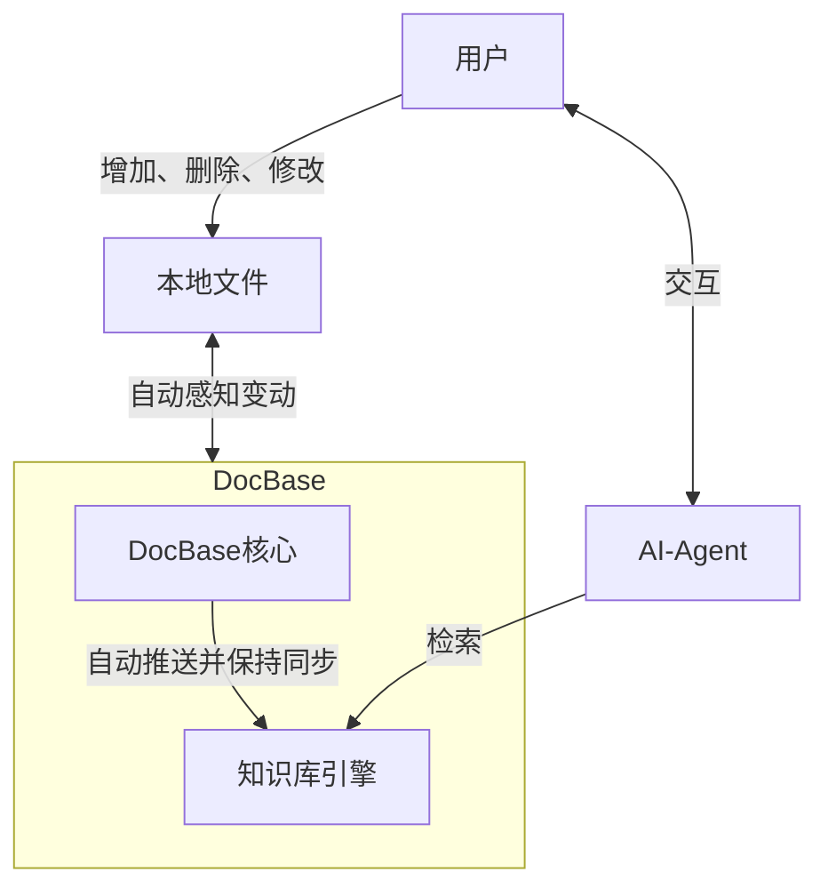

# 🗃️ DocBase

DocBase 专注于自动构建专业 AI 知识库，特色是<mark>将本地文件实时嵌入到知识库引擎中</mark>。

<mark>无论是增加、删除还是修改操作</mark>，DocBase 都会<mark>自动更新</mark>知识库引擎中的内容，不需要专为 RAG 手动维护一个知识库。

此外，<mark>DocBase 兼容 Dify 外部知识库协议</mark>，你可以轻松将 DocBase 作为 Dify 外部知识库使用，而不必将本地数据上传云端。

 
<NCard title="🗃️ ❤️ Dify" link="https://dify.ai/">
https://dify.ai/
</NCard>

## 创新性

- 将多格式文档从文件系统直接映射到向量引擎中，并实时监控变动。使用高效文件同步算法，最小化嵌入 Token 消耗。
- 系统设计为插件模式，可以动态拓展支持的文件格式、文件切分方案。
- 嵌入 WebDav 支持，可以直接将云端知识库挂载到本地文件系统进行编辑。
- 可作为 Dify 外部知识库，扩展无限可能。
- Docker 私有部署，一键启动，数据安全，省心省力。
- MeiliSearch 驱动，全文、模糊、向量检索无死角。

## 设计

1. 设计架构

  

2. DocBase 自带 Swagger 文档服务，你可以访问 /doc 路径获取文档。

  

3. DocBase 自带管理面板，请访问 /路径

  

4. 使用 webdav 管理知识库

DocBase 自带 WebDAV 服务，可以通过 WebDAV 增删改查知识库文件，DocBase 会自动同步更改到向量引擎中。

  

## 使用场景

### 作为 Dify 外部知识库使用 <Badge type="tip" text="recommend" />

具体流程：[🗃️ Dify](./dify.md)

  

## 对比

| 功能/特性 | DocBase | IMA | Cherry Studio |
| --------- | ------- | --- | ------------- |
| 部署方式 | 本地私有部署（Docker，可云端，可离线） | 商用公共服务器 | 本地部署 |
| 数据安全性 | 高（本地存储，数据不离开本地） | 低（云端存储，依赖服务商） | 高（本地存储选项） |
| 文件格式支持 | 多格式（通过插件扩展） | 多种常见格式 | 多种常见格式 |
| 向量搜索引擎 | MeiliSearch | 自有向量搜索引擎 | 本地向量搜索引擎 |
| 文件同步与监控 | 实时监控文件变动，高效同步 | - | - |
| 系统集成 | 可作为 Dify 的外部知识库 | - | - |
| 插件扩展 | 支持动态扩展文件格式和切分方案 | - | - |
| 用户界面 | 简洁易用，专注于知识管理 | 现代化 UI | 直观且功能丰富的界面 |
| 成本 | 开源免费，长期成本极低 | 订阅模式，按需付费 | 提供免费和付费版本，付费版功能更全 |
| 目标用户 | 需要知识管理的企业、团队或个人 | 个人/企业 | 个人知识管理（开源版） |
| 开源情况 | 开源 | 闭源 | 开源 |

## 可以应用的商业场景：

1. 知识付费新途径
   直接把文档丢到知识库中即可，无需转换格式、上传管理，0 成本上手。可以仅暴露搜索 API，可以解决传统知识付费内容容易被复制剽窃、检索困难的痛点。
2. 个人/企业知识大脑
   文档集中存储，多知识库空间共享、协作编辑检索知识文档，满足私有化云端部署知识库需要。
3. 教育培训助手
   既是云盘，也是智能老师，把教材 PPT、Word 等直接存入后，知识库即可自动索引问答。
4. 科研助手
   将 PDF 直接丢入知识库，不用额外格式转换。
5. 客户服务助手
   将说明文档丢入知识库，与 dify 配合构建智能客服
6. 法规速查助手
   法规向量检索命中度不高，可调高全文索引的权重，DocBase 是向量知识库，也是检索引擎

---

::: tip 温馨提示
如果文档中发现错误，或提交文档修改，或丰富本站文档，可点击页面底部的编辑按钮
:::
