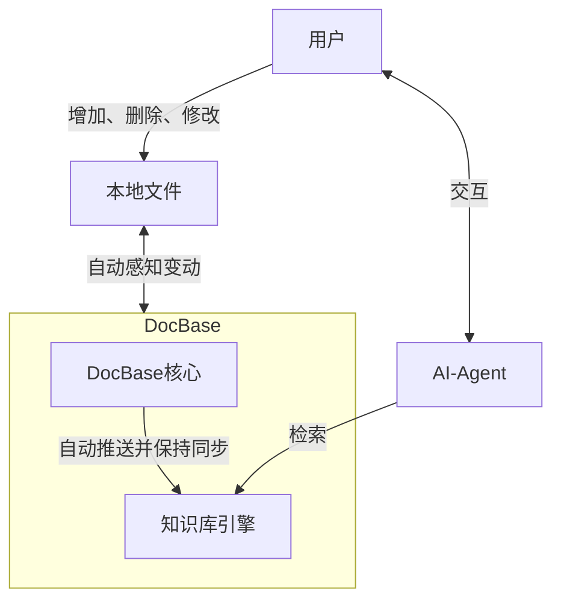

# 🗃️ DocBase

DocBase 专注于自动构建专业 AI 知识库，特色是<mark>将本地文件实时嵌入到知识库引擎中</mark>。

<mark>无论是增加、删除还是修改操作</mark>，DocBase 都会<mark>自动更新</mark>知识库引擎中的内容，不需要专为 RAG 手动维护一个知识库。

此外，<mark>DocBase 兼容 Dify 外部知识库协议</mark>，你可以轻松将 DocBase 作为 Dify 外部知识库使用，而不必将本地数据上传云端。

 
<NCard title="🗃️ ❤️ Dify" link="https://dify.ai/">
https://dify.ai/
</NCard>

## 使用场景

### 作为知识搜索引擎

[部署后](./start.md)，通过 WebDav 将知识库映射到本地，编辑本地文件云端知识自动更新，而后便捷搜索

  

### 作为 Dify 外部知识库使用 <Badge type="tip" text="recommend" />

具体流程：[🗃️ Dify](./dify.md)

  

---

::: tip 温馨提示
如果文档中发现错误，或提交文档修改，或丰富本站文档，可点击页面底部的编辑按钮
:::
